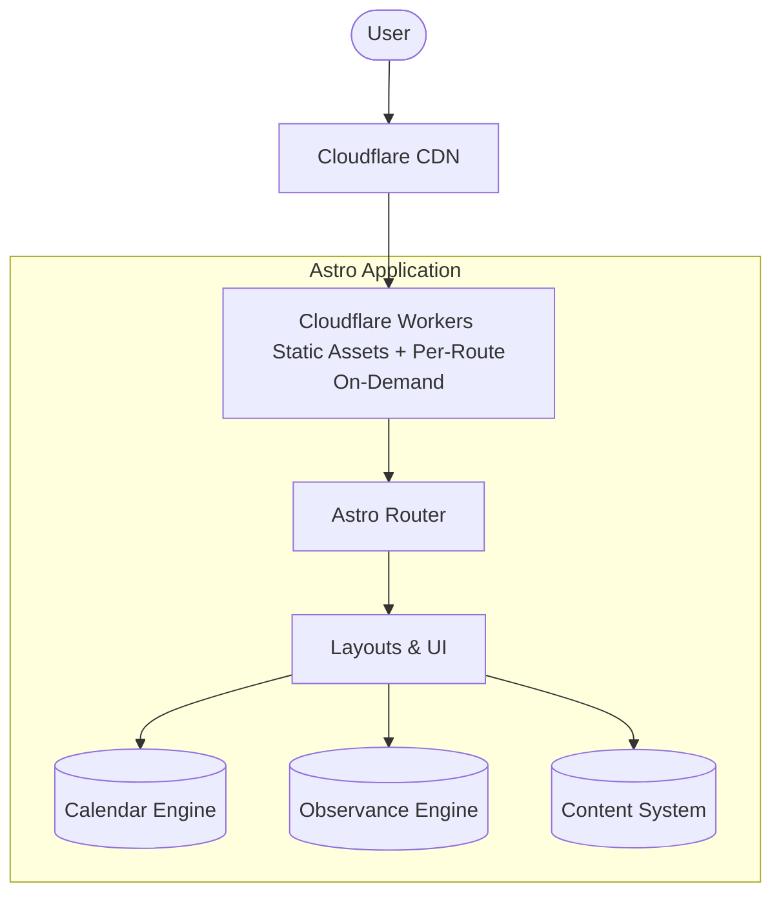
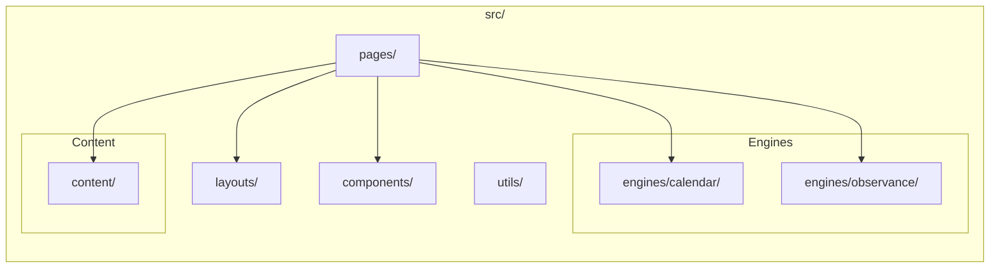

# System Architecture

## High-Level Architecture

## Three-Engine Separation
To ensure clean code and testability, the core logic is strictly separated:
1. **Calendar Engine:** "What date is it?" (Mathematical conversions, timezone handling, utilizing Intl / @internationalized/date).
2. **Observance Engine:** "What is observed today?" (Rules engine matching dates to cultural, national, and religious events).
3. **Content System:** "What does it mean?" (Markdown/MDX content mapping to observances).

## Tech Stack Decisions & Rationale
- **Framework:** Astro. *Rationale:* Content-heavy static-first framework that ships zero JS by default. Built-in Content Collections are perfect for structured stories and metadata.
- **Language:** TypeScript. *Rationale:* Absolute necessity for type safety in complex mathematical calendar calculations.
- **Hosting:** Cloudflare Workers with Static Assets. *Rationale:* Free tier (100K requests/day), powerful edge rendering, and global CDN. Note: `@astrojs/cloudflare` adapter v14+ is Workers-only (Pages removed).

## Rendering Strategy
- **Static Pre-rendered (SSG):** "Today" page (rebuilt daily via cron), Calendar overview pages, Observance pages, Story pages, Month/Year archives.
- **On-Demand (per-route opt-in via `export const prerender = false`):** Date lookup for arbitrary historic/future dates, dynamic calendar conversions. Only routes that genuinely require server-side computation should opt in.
- **Client-Side:** Real-time "today" indicator, timezone-aware localized display (Progressive Enhancement only).

## Module Boundaries

## Data Flow
`Request → Route → Page/Layout → Engine Query → Content Query → Render`

## Content Collections Strategy
Use Astro's built-in Content Collections with Zod schemas to ensure type-safe data loading:
- `stories`: In-depth articles on festivals.
- `observances`: Metadata defining a festival.
- `calendars`: Metadata and historical background of the calendar systems themselves.

## API Strategy
- **Minimal API surface.** 
- Rely on internal engine functions directly at build time (static pages) and at request time (on-demand routes). 
- No public REST API for MVP (avoids abuse and infrastructure costs).

## State Management
- **Minimal to None.**
- Static pages with progressive enhancement via standard Web Components or vanilla JS snippets.
- No heavy client-side state framework (No React/Vue/Svelte needed for MVP).

## Performance Budget
**VERIFIED FACT:**
- **LCP:** ≤ 2.5s
- **INP:** ≤ 200ms
- **CLS:** ≤ 0.1
- **JS Payload:** Zero JS by default for content pages.

## Scalability Model
- **Add calendars:** Drop in a new adapter module in `src/engines/calendar/`.
- **Add observances:** Drop in a new rule in `src/engines/observance/` and a content entry.
- **Add stories:** Add a markdown file to `src/content/stories/`.

## Open Questions
- **OPEN QUESTION:** Should we rebuild the "Today" static page daily via CI/CD (GitHub Actions cron) or use an ISR-like approach with Cloudflare Workers caching?
