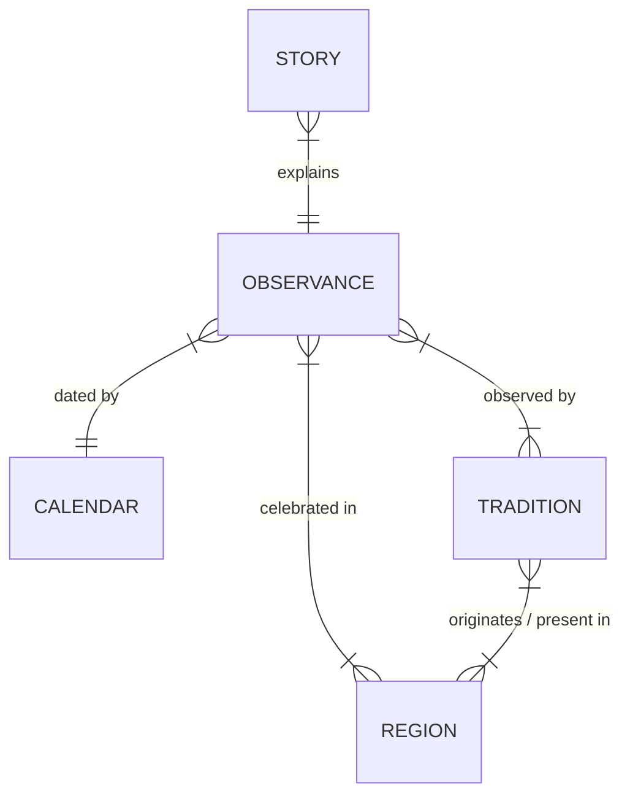

# Content System Architecture

The Content System manages the cultural, historical, and narrative data. It drives the "What does it mean?" and "Story Behind the Day" features.

## Content Types (Astro Content Collections)

### 1. Stories Collection
A story is a rich Markdown/MDX file describing the meaning behind an observance.

**Example: `src/content/stories/diwali.md`**
```yaml
title: "Diwali — The Festival of Lights"
slug: diwali
observanceRef: diwali
calendars: ["hindu-vikram-samvat"]
traditions: ["hindu"]
regions: ["india", "nepal", "global-diaspora"]
summary: "Why millions celebrate the triumph of light over darkness"
author: "Editorial Team"
datePublished: 2026-01-15
dateModified: 2026-08-20
sources:
  - name: "Encyclopedia Britannica"
    url: "https://www.britannica.com/topic/Diwali-Hindu-festival"
  - name: "Ministry of Culture, India"
    url: "..."
verificationStatus: verified
tags: ["festival", "light", "hindu", "jain", "sikh"]
```

**Story content structure (Markdown body):**
1. What is this? (brief overview)
2. Why is it observed? (significance)
3. Where did it originate? (history)
4. What is the historical background?
5. What does it mean today?
6. What do people traditionally do?
7. How does the tradition differ by region/community?
8. How has the observance evolved?
9. Sources and References

### 2. Observances Collection
Contains structured YAML/JSON data for observance metadata (dates, rules, calendars). This remains distinct from the narrative story content.

### 3. Calendars Collection
Metadata about each supported calendar system (name, type, description, regions, related observances) stored as structured data.

### 4. Traditions Collection
Cultural/religious tradition metadata (name, description, regions, related calendars, related observances).

## Zod Schema Definitions (Astro config)

```typescript
import { z, defineCollection } from 'astro:content';

export const storiesCollection = defineCollection({
  type: 'content',
  schema: z.object({
    title: z.string(),
    slug: z.string(),
    observanceRef: z.string().optional(),
    calendars: z.array(z.string()),
    traditions: z.array(z.string()),
    regions: z.array(z.string()),
    summary: z.string().max(200),
    author: z.string().default("Editorial Team"),
    datePublished: z.date(),
    dateModified: z.date(),
    sources: z.array(z.object({
      name: z.string(),
      url: z.string().url().optional(),
    })),
    verificationStatus: z.enum(['verified', 'provisional', 'unverified']),
    tags: z.array(z.string()).default([]),
  }),
});
```

## Content Relationships



## Content Creation Guidelines
- **Research First**: All cultural/religious content must be researched and source-backed.
- **AI Constraints**: AI can assist with drafting and organization, but factual claims MUST be verified against human-curated sources. Do NOT invent historical or religious information.
- **Neutral Tone**: Content must be culturally respectful and neutral. Avoid sectarian bias or religious promotion.
- **Attribution**: Clear attribution of sources is mandatory.
- **Maintenance**: Implement a regular review and update cycle for living documents.
- **Quality**: "Story Behind the Day" pages are a core product differentiator. They must be substantial, insightful, and avoid thin, generic summaries.

## Editorial Standards
- **[FACT]** Factual accuracy takes absolute precedence over development speed.
- **[REQUIREMENT]** Source attribution is required for all non-trivial historical claims.
- **[PROCESS]** Cultural sensitivity review is required for major religious festivals.
- No mass-generated religious/cultural claims.
- Verification status is explicitly tracked per content item (`verificationStatus`).
- Modification timestamps are strictly maintained for caching and auditing.
